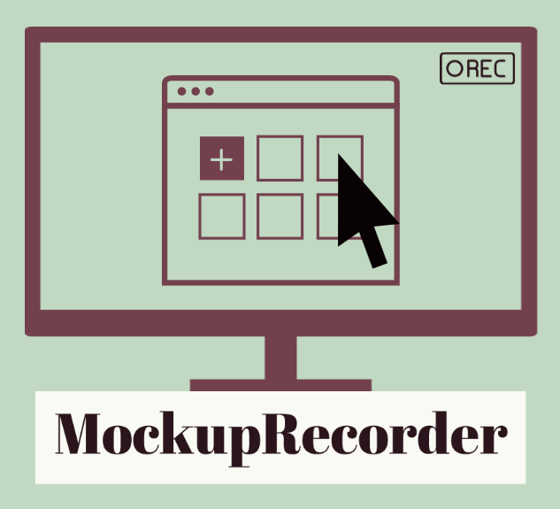

<!-- PROJECT SHIELDS -->
<!--
*** I'm using markdown "reference style" links for readability.
*** Reference links are enclosed in brackets [ ] instead of parentheses ( ).
*** See the bottom of this document for the declaration of the reference variables
*** for contributors-url, forks-url, etc. This is an optional, concise syntax you may use.
*** https://www.markdownguide.org/basic-syntax/#reference-style-links
-->
<!--[![Twitter][twitter-shield]][twitter-url]
[![LinkedIn][linkedin-shield]][linkedin-url]
-->

<!-- PROJECT LOGO -->
 

  

<h2 align="center">MockupRecorder 
<i>"Video as a By-Product of Digital Prototyping"</i></h2>

  

   
    <!--<a href="https://github.com/okarras/MockupRecorder">View Demo</a>
    ·-->
    <a href="https://github.com/okarras/MockupRecorder/issues">Report Bug</a>
    ·
    <a href="https://github.com/okarra/MockupRecorder/issues">Request Feature</a>
  

<!-- TABLE OF CONTENTS -->

  
Table of Contents

  <ol>
    <li><a href="#about-the-project">About the Project</a></li>
    <li><a href="#built-with">Built With</a></li>
    <li><a href="#getting-started">Getting Started</a></li>
    <li><a href="#usage">Usage</a></li>
    <li><a href="#publications">Publications</a></li>
    <li><a href="#contributing">Contributing</a></li>
    <li><a href="#license">License</a></li>
    <li><a href="#contact">Contact</a></li>
    <li><a href="#acknowledgments">Acknowledgments</a></li>
  </ol>

<!-- ABOUT THE PROJECT -->
## About the Project

<!--[![Product Name Screen Shot][product-screenshot]](https://github.com/okarras/ContiVQAExp)-->

    MockupRecorder is a software tool for capturing and representing the dynamic aspect of interaction in digital prototyping of scenarios in a way that can easily be created, modified, and is always repeatedly playable without the necessity of having a video. Thus, the prototyping of scenarios does not depend on the existence of videos but integrates the opportunity to automatically produce and use them. In particular, MockupRecorder represents interactions as sequences of events generated by responsive controls in hand-drawn and digitally created mockups. Based on the combination of event sequences and mockups, videos can be produced automatically as a by-product by playing and recording the event sequences on the mockups. Changes and alternative scenarios are unproblematic since videos can be produced automatically from modified event sequences and mockups. 

(<a href="#top">back to top</a>)

<!-- BUILT WITH -->
## Built With

* [OpenJDK](https://openjdk.java.net/)
* [JavaFX](https://openjfx.io/)
* [Jackson](https://github.com/FasterXML/jackson)
* [JavaCV](https://github.com/bytedeco/javacv)

(<a href="#top">back to top</a>)

<!-- GETTING STARTED -->
## Getting Started
You need to install [OpenJDK](https://openjdk.java.net/) and [JavaFX](https://openjfx.io/) on your computer to run the project.

We use [Visual Studio Code](https://code.visualstudio.com/) for developement and can recommend the following [YouTube Tutorial](https://www.youtube.com/watch?v=H67COH9F718).

(<a href="#top">back to top</a>)

<!-- USAGE EXAMPLES -->
## Usage
The application of MockupRecorder is shown in the following [document](example/README.md) with a screenshot, description, and an example.

(<a href="#top">back to top</a>)

<!-- PUBLICATIONS -->
## Publications

If you want to cite this project, we suggest the following reference:

>Oliver Karras, Carolin Unger-Windeler, Lennart GLauer and Kurt Schneider 
>[__Video as a By-Product of Digital Prototyping: Capturing the Dynamic Aspect of Interaction__](https://ieeexplore.ieee.org/abstract/document/8054839) 
>In: IEEE 25th International Requirements Engineering Conference Workshops (REW), IEEE, 2017.

The details of the implementation of MockupRecorder are reported in the following reference:

>Lennart Glauer 
>__Specification of GUI Interactions as Videos__ 
>Leibniz Universität Hannover, 2017.

The details of the "Video as a By-Product" approach, on which MockupRecorder is based, are reported in the following reference:

>Oliver Karras 
>[__Supporting Requirements Communication for Shared Understanding by Applying Vision Videos in Requirements Engineering__](https://books.google.de/books?id=sEoyEAAAQBAJ&printsec=frontcover&hl=de#v=onepage&q&f=false) 
>Logos Verlag Berlin GmbH, 2021.

The following reference is a video produced with the MockupRecorder: 

>Oliver Karras 
>[__Vision Video - Interaction Process of the Purchase of a Product by a Customer in a Webshop__](https://doi.org/10.5281/zenodo.3696798) 
>Zenodo, https://doi.org/10.5281/zenodo.3696798, 2020.

(<a href="#top">back to top</a>)

<!-- CONTRIBUTING -->
## Contributing

Contributions are what make the open source community such an amazing place to learn, inspire, and create. Any contributions you make are **greatly appreciated**.

If you have a suggestion that would make MockupRecorder better, please fork the repo and create a pull request. You can also simply open an issue with the tag "enhancement".
Don't forget to give the project a star! Thanks again!

1. Fork the Project
2. Create your Feature Branch (`git checkout -b feature/AmazingFeature`)
3. Commit your Changes (`git commit -m 'Add some AmazingFeature'`)
4. Push to the Branch (`git push origin feature/AmazingFeature`)
5. Open a Pull Request

(<a href="#top">back to top</a>)

<!-- LICENSE -->
## License

Distributed under the MIT License. See `LICENSE` for more information.

(<a href="#top">back to top</a>)

<!-- CONTACT -->
## Contact

[Dr. rer. nat. Oliver Karras](https://www.oliver-karras.de) - [@OliverKarras](https://twitter.com/OliverKarras) - me@oliver-karras.de

(<a href="#top">back to top</a>)

<!-- ACKNOWLEDGMENTS -->
## Acknowledgments

[Lennart Glauer](https://www.linkedin.com/in/lennart-glauer/) as main developer of MockupRecorder.

(<a href="#top">back to top</a>)

