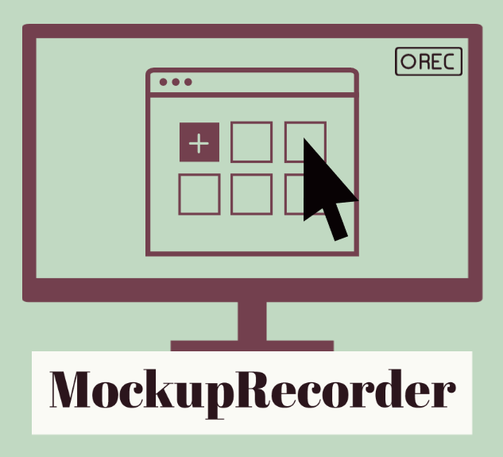

<!-- PROJECT LOGO -->
 

  

<h2 align="center">MockupRecorder 
<i>"Video as a By-Product of Digital Prototyping"</i></h2>

<!-- TABLE OF CONTENTS -->

  
Table of Contents

  <ol>
    <li><a href="#about-this-document">About this Document</a></li>
    <li><a href="#about-mockuprecorder">About MockupRecorder</a></li>
    <li><a href="#example">Example</a></li>
  </ol>

<!-- ABOUT THIS DOCUMENT -->
## About this Document

    This document demonstrates the application of MockupRecorder with a screenshot and descriptions. In addition, we provide an example that can be loaded into MockupRecorder.

(<a href="#top">back to top</a>)

<!-- ABOUT MockupRecorder -->
## About MockupRecorder

MockupRecorder imports mockups either as FXML source files or as PNG / JPEG files that are automatically embedded in FXML source files. FXML is a markup language for defining graphical user interfaces of JavaFX applications. The FXML format is necessary for adding the responsive controls to hand-drawn and digitally created mockups to generate the interaction events to be captured. The screenshot shows the graphical user interface of the MockupRecorder with its three main components: (1) mockup chooser, (2) scenario timeline, and (3) mockup preview. 
The mockup chooser (1) is a list of preview images of all mockups which have been imported to a project in MockupRecorder. This list provides an overview of all available mockups of one project. Each mockup in this list can be displayed in its original size in the mockup preview (3) by double-clicking on the preview image of a mockup. The mockups can be edited with the Gluon Scene Builder by right-clicking on its preview image and selecting the menu item "Edit" from the opened context menu. The mockups can be placed in the scenario timeline (2) using drag and drop. The scenario timeline (2) is a list of all mockups contained in a scenario. Based on the metaphor of a "filmstrip", each mockup in the scenario timeline represents a "keyframe" of a video. The order of these mockups defines the scenario sequence which can be edited by deleting or dragging and dropping a "key frame" in the "filmstrip". For capturing and playback interaction events, a mockup of the scenario timeline must be displayed in the mockup preview by left-clicking on the corresponding "key frame". The mockup preview (3) consists of two components. Besides a view for displaying a mockup, the mockup preview has a toolbar for capturing and playing interaction events on the displayed mockup. The MockupRecorder supports mouse, keyboard, and touch events. The export function is the key feature of the MockupRecorder and is therefore presented separately. The toolbar of the mockup preview provides the export function for the scenario specified in the scenario timeline. The scenario and its interactions are exported by displaying one mockup after the other in the mockup preview and executing the interaction events generated by the computer. This visualization is recorded using screencasting to produce a video. In addition to the video, the MockupRecorder exports each mockup in the scenario as a PNG file, e.g., to include these images in the corresponding specification.

(<a href="#top">back to top</a>)

<!-- EXAMPLE -->
## Example

The folder [onlineshop](onlineshop) provides an example that can be loaded and used in the MockupRecorder. This example describes in detail the interaction process between a user and a webshop to purchase a product. The example can be loaded into MockupRecorder by clicking on "Datei -> Szenario öffnen" from the menu and selecting the file "onlineshop-usb-stick-kaufen.szenario".

(<a href="#top">back to top</a>)
